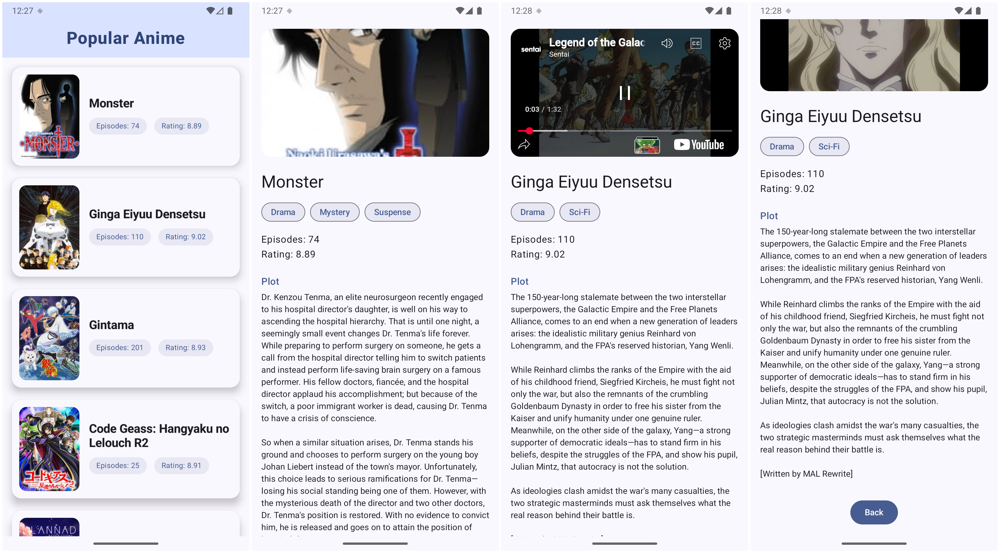

# Popular Anime App

A modern Android application for browsing popular anime, implemented using Jetpack Compose, Material3, Room, and Jikan API.  
This project demonstrates a clean UI, smooth navigation, and local caching, focused on performance and usability for anime fans.

---

## Assumptions Made

- Jikan API will provide anime data, including images, title, episodes, ratings, and trailer URLs.
- Trailer URLs from Jikan are generally YouTube links, played using YouTubePlayerView for compatibility.
- User runs the app on a device/emulator with working internet access and basic system bar support.
- The database exists for Room persistence but the app can fallback to network when Room DB is empty.
- Only popular/top anime and their basic details are shown (no authentication, no review system, no advanced filtering).

---

## Features Implemented

- **Anime List Screen**:
    - Loads and displays a scrollable list of popular anime with posters, title, episode count, and rating.
    - Animated fade-in for more dynamic experience.
    - Modern Material3 design with rounded cards, color theming, and responsive layout.
    - Center-aligned top app bar for branding and clarity.

- **Anime Detail Screen**:
    - Shows high-resolution poster/trailer video, anime details, genre chips, synopsis.
    - Trailer playback using YouTubePlayerView for YouTube.
    - Smooth scroll and clean typography for readability.
    - Back and retry buttons for easy navigation and error recovery.

- **Error and Loading States**:
    - Fullscreen loading indicators while fetching data.
    - Graceful error messages with retry options if network/database fails.

- **Navigation**:
    - Single-activity Compose navigation using NavHostController.
    - List-to-detail and back navigation fully implemented.

- **Room & Retrofit Integration**:
    - Anime data is cached in Room for offline access.
    - All network requests via Retrofit.

- **Code Structure**:
    - ViewModel-per-screen structure with intent/state sealed classes (MVI-inspired).
    - UI components separated for reuse and clarity.

---

## Known Limitations

- **Trailer Playback**: Only supports trailers via YouTube.
- **Genres**: Displayed as flat strings; advanced genre exploration/search is not implemented.
- **Offline Mode**: Room caching is present, but initial load requires network.
- **Error Feedback**: Network/server errors are shown, but no deep retry logic or long-term recovery.
- **Details**: No cast, reviews, or extended details for anime (only poster, episodes, rating, and synopsis).
- **Design**: UI is clean/minimal, but lacks advanced UI flourishes or parallax image effects for banners.
- **Testing**: No full unit/instrumentation test coverage provided.

---

## Screenshots

---

## Getting Started

- Clone the repo
- Set up your Android Studio with minimum SDK 26+
- Build and run on emulator/device with internet

---

## Github Repo

- [Github Repo] (https://github.com/codewithrish/AnimeAppDemo.git)
